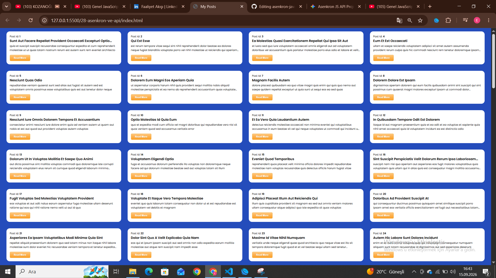

# 🌐 Asenkron JS & API Uygulaması

<p align="center">
  
</p>

Bu proje; modern **JavaScript (ES6+)** asenkron programlama tekniklerini (**AJAX**, **Fetch API**, **Async/Await**) kullanarak harici/yerel bir API'den dinamik veri çekmek ve kullanıcı arayüzünü anlık olarak güncellemek amacıyla geliştirilmiştir.

---

## 📸 Uygulama Ekran Görüntüleri

<p align="center">
  
  
  
</p>

---

## 🚀 Öne Çıkan Özellikler

* **Dinamik Veri Akışı:** Sayfa yenilenmeden verilerin arka planda çekilmesi ve DOM üzerine işlenmesi.
* **Modern Asenkron Mimari:** Callback karmaşası yerine temiz ve sürdürülebilir `async/await` yapısının kullanımı.
* **Hata Yönetimi (Error Handling):** API isteklerinde oluşabilecek hataların `try...catch` blokları ile yakalanması ve kullanıcıya bildirilmesi.
* **Duyarlı (Responsive) Arayüz:** HTML5 ve CSS3 kullanılarak oluşturulmuş responsive tasarım.

---

## 🛠️ Kullanılan Teknolojiler

* **HTML5:** Sayfa yapısı ve semantik etiketleme.
* **CSS3:** Modern UI tasarımları ve görsel stiller.
* **JavaScript (ES6+):**
  * **AJAX & XMLHttpRequest:** Geleneksel asenkron veri transferi.
  * **Fetch API:** Modern Promise tabanlı ağ istekleri.
  * **Async / Await:** Okunabilir ve temiz asenkron kod yapısı.

---

## 📂 Proje Dizin Yapısı

```text
.
├── index.html          # Ana HTML dosyası
├── style.css           # CSS stilleri ve düzenlemeler
└── script.js           # API istekleri ve DOM yönetimi
